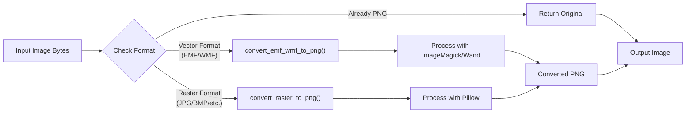
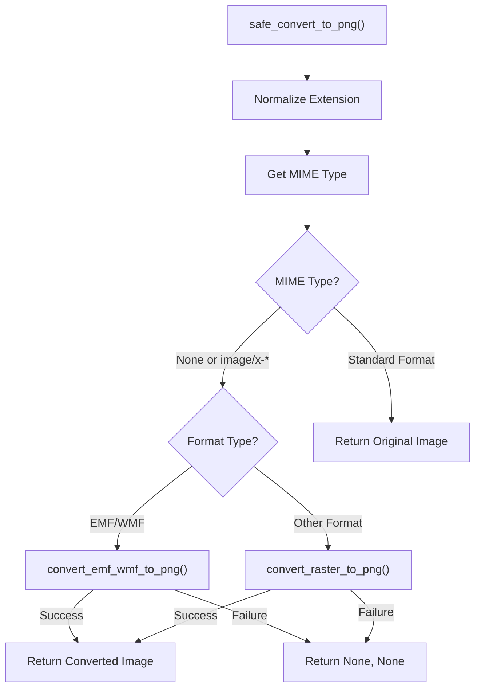

# ImageProcessing Module Documentation

## Overview

The `ImageProcessing` module provides utilities for handling and converting various image formats, with a focus on standardizing images to PNG format. This module is particularly useful for document processing systems that need to extract and normalize embedded images from various document formats.

## Image Conversion Pipeline



## Key Components

### 1. MIME Type Mapping

The module provides a comprehensive mapping of file extensions to MIME types:

```python
EXT_TO_MIME = {
    "jpg": "image/jpeg",
    "jpeg": "image/jpeg",
    "png": "image/png",
    "bmp": "image/bmp",
    "gif": "image/gif",
    "tiff": "image/tiff",
    "webp": "image/webp",
    "wmf": "image/x-wmf",  # Will be converted
    "emf": "image/x-emf",  # Will be converted
}

```

### 2. Conversion Functions

#### `safe_convert_to_png(image_bytes, ext)`

**Purpose**: Main entry point for image conversion, determining the appropriate conversion method based on image format.

**Flow**:
1. Normalize extension and determine MIME type
2. For vector formats (EMF/WMF), use Wand/ImageMagick conversion
3. For raster formats, use Pillow conversion
4. Return converted PNG image bytes and updated extension



#### `convert_emf_wmf_to_png(image_bytes, ext)`

**Purpose**: Converts Windows Metafile (WMF) and Enhanced Metafile (EMF) vector formats to PNG using ImageMagick.

**Process**:
1. Uses Wand library (ImageMagick binding) to open the image
2. Sets output format to PNG
3. Returns converted image bytes

```python
def convert_emf_wmf_to_png(image_bytes: bytes, ext: str) -> tuple[bytes, str] | tuple[None, None]:
    """Uses wand (ImageMagick) to convert EMF/WMF to PNG."""
    try:
        with WandImage(blob=image_bytes) as img:
            img.format = 'png'
            converted_bytes = img.make_blob()
            return converted_bytes, "png"
    except WandException as e:
        print(f"[!] Wand conversion failed: {e}")
        return None, None

```

#### `convert_raster_to_png(image_bytes)`

**Purpose**: Converts raster image formats (JPEG, BMP, etc.) to PNG using Pillow.

**Process**:
1. Opens image bytes with Pillow
2. Converts to RGB color space
3. Saves as PNG to an in-memory buffer
4. Returns converted image bytes

```python
def convert_raster_to_png(image_bytes: bytes) -> tuple[bytes, str] | tuple[None, None]:
    """Uses Pillow to convert raster formats to PNG."""
    try:
        with Image.open(io.BytesIO(image_bytes)) as img:
            buf = io.BytesIO()
            img.convert("RGB").save(buf, format="PNG")
            return buf.getvalue(), "png"
    except Exception as e:
        print(f"[!] Pillow conversion failed: {e}")
        return None, None

```

### 3. Utility Functions

#### `encode_image_base64(image_bytes)`

**Purpose**: Encodes image bytes to Base64 string representation for embedding in JSON, HTML, or API responses.

```python
def encode_image_base64(image_bytes: bytes) -> str:
    """Encodes image bytes to Base64."""
    return base64.b64encode(image_bytes).decode("utf-8")

```
Here’s a more polished and clear version of your documentation with improved formatting, grammar, and structure:

---

## Dependencies  

This module requires the following dependencies:  

### **Python Libraries**  
1. **Pillow (PIL)** – Image processing for raster formats 
2. **Wand** – Python binding for ImageMagick, used for vector format conversion 
3. **Python Standard Library Modules:**  
   - `io` – Handles in-memory file operations  
   - `base64` – Encodes/decodes images as Base64 strings  

### **System Requirements**  
- **ImageMagick** – Required for `.WMF` and `.EMF` file conversion (*must be installed separately*)  

### **Notes**  
 **ImageMagick Setup:**  
   - Ensure ImageMagick is properly installed and configured before using Wand for vector conversions.  
   - On **Windows**, ImageMagick supports both `.WMF` and `.EMF`.  
   - On **non-Windows systems (Linux/macOS)**, ImageMagick may only handle `.WMF` files properly.  
     - For `.EMF` conversion, consider using **LibreOffice** as an alternative.  

## Error Handling

Each conversion function includes robust error handling:

- Try-except blocks catch and log conversion errors
- Failed conversions return `None, None` to indicate failure
- Detailed error messages are printed for debugging

## Integration with Document Processing

This module integrates with the document processing pipeline to:

1. Standardize image formats for vision model processing
2. Ensure consistent image handling regardless of source format
3. Convert Windows-specific vector formats (EMF/WMF) that might be embedded in Microsoft Office documents


## Usage Example

```python
from ImageProcessing import safe_convert_to_png, encode_image_base64

# Example: Convert an extracted image to PNG
def process_document_image(image_bytes, original_extension):
    # Normalize to PNG format
    png_bytes, ext = safe_convert_to_png(image_bytes, original_extension)
    
    if png_bytes:
        # Option 1: Save to file
        with open(f"extracted_image.{ext}", "wb") as f:
            f.write(png_bytes)
            
        # Option 2: Encode for API request
        base64_image = encode_image_base64(png_bytes)
        api_payload = {
            "image": base64_image,
            "format": ext
        }
        
        # Use in API request...
        return True
    else:
        print("Image conversion failed")
        return False

```

## Best Practices

When using this module:

1. Always check return values, as conversions might fail
2. Use the standardized PNG format for consistent processing
3. For web applications, consider using the Base64 encoding function for embedding images directly in JSON responses

## Conclusion

The ImageProcessing module provides essential functionality for handling various image formats in document processing workflows. By standardizing images to PNG format, it ensures consistent processing and compatibility with downstream systems like vision models or web applications.