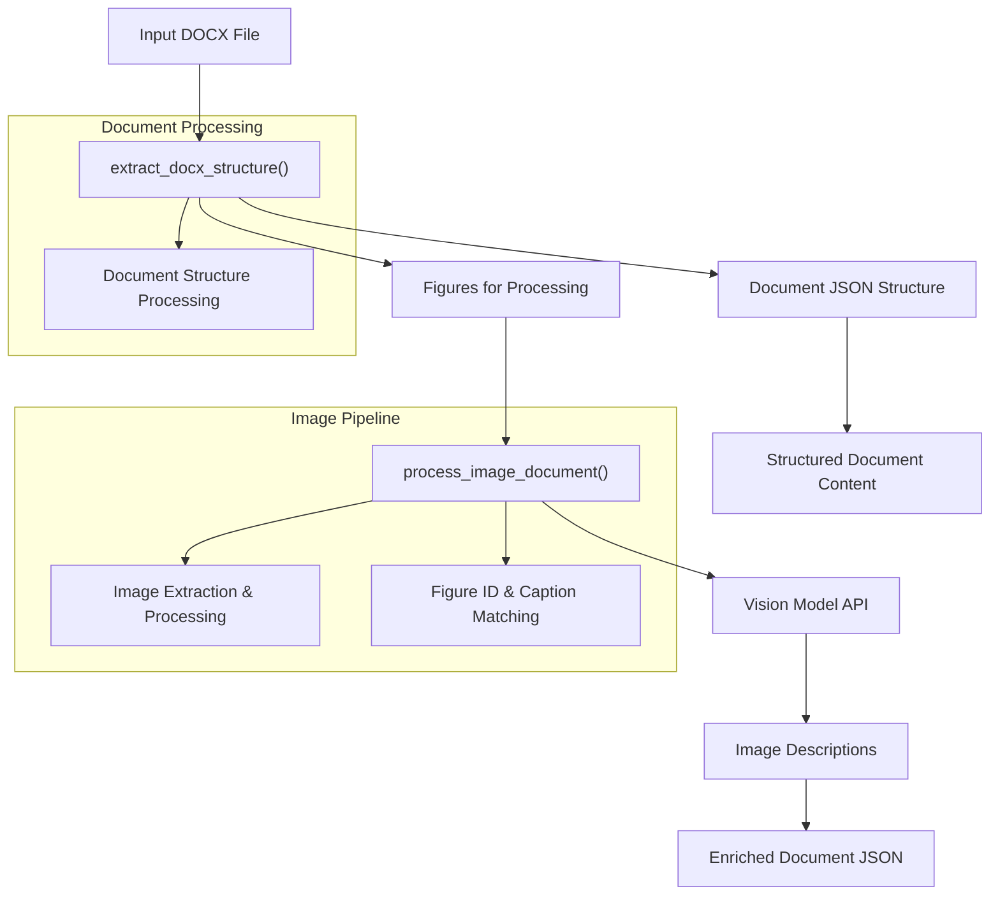
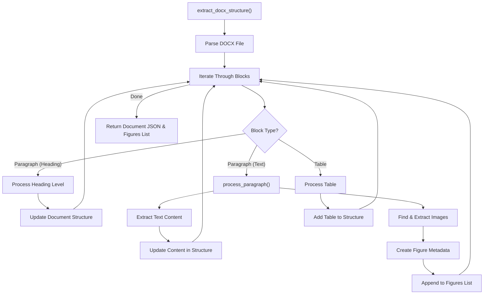
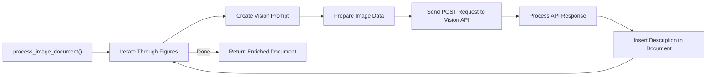
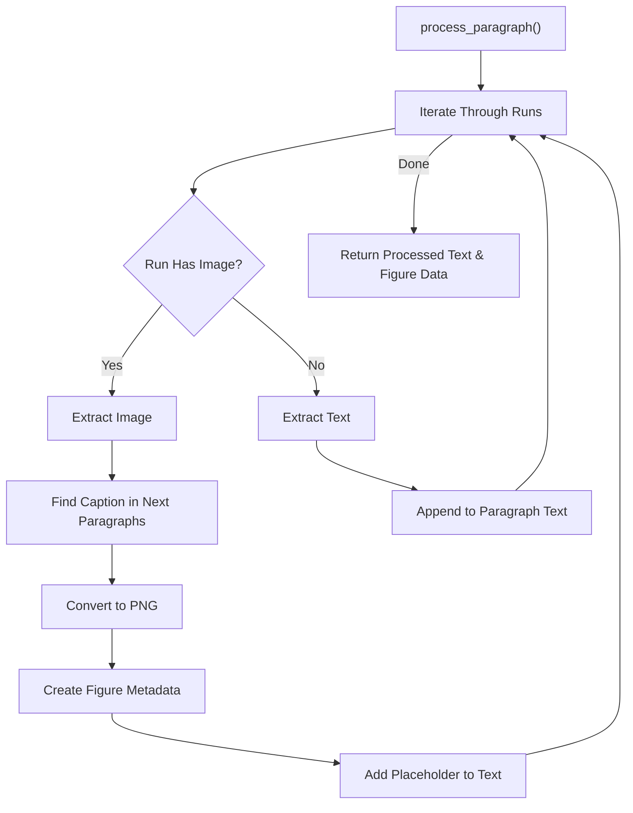

# Documentation: Document Processing with Image Extraction Pipeline

This documentation provides a comprehensive overview of the document processing system that extracts structured content from DOCX files, with special handling for embedded images and tables.

## Overview

The system processes DOCX files, extracting text content, tables, and images while preserving document structure. It identifies sections based on heading levels, extracts embedded images, and sends them to a vision model for description. The result is a structured JSON representation of the document's content.

## System Architecture and Pipeline



## Key Components and Functions

### 1. Document Structure Extraction

The `extract_docx_structure` function is the main entry point for processing DOCX files:



### 2. Image Processing Pipeline

The system handles embedded images with the following process:



### 3. Paragraph Processing

The `process_paragraph` function handles text extraction and image identification:



## Data Structures

### Document JSON Structure

```json
{
    "document_name": "example.docx",
    "content": [
        {
            "title": "Section Title",
            "description": "Section text content...",
            "summary": "",
            "tables": [
                {
                    "description": "Table description",
                    "table number": 1,
                    "summary": "",
                    "name": ""
                }
            ],
            "figures_meta_data": [
                {
                    "figure_id": "<<<Figure 1: Example>>>",
                    "last_paragraph": "Text preceding the figure..."
                }
            ],
            "subsections": [
                {
                    "title": "Subsection Title",
                    "description": "",
                    "summary": "",
                    "text_content": "Subsection content...",
                    "tables": [],
                    "figures_meta_data": [],
                    "subsubsections": [
                        {
                            "title": "Subsubsection Title",
                            "text_content": "Subsubsection content...",
                            "figures_meta_data": [],
                            "tables": []
                        }
                    ]
                }
            ]
        }
    ]
}

```

### Figure Metadata Structure

```json
{
    "figure_id": "<<<Figure 1: System Diagram>>>",
    "figure_name": "Figure 1: System Diagram",
    "last_paragraph": "As shown in the following figure...",
    "image_bytes": "<binary data>",
    "image_ext": "png",
    "section_title": "Introduction",
    "section_idx": 0,
    "subsection_title": "System Overview",
    "subsection_idx": 1,
    "subsubsection_title": "Architecture",
    "subsubsection_idx": 0
}

```

## Key Functions Explained

### 1. `extract_docx_structure(file_path)`

**Purpose**: Main function to process a DOCX file and extract its structure.

**Process**:
1. Opens the DOCX file
2. Iterates through elements (paragraphs and tables)
3. Identifies section structure based on heading levels
4. Processes paragraphs to extract text and images
5. Tracks tables with descriptions
6. Returns structured document JSON and list of figures

**Returns**: 
- Document JSON structure
- List of figure metadata for further processing

### 2. `process_paragraph(paragraph, next_paragraphs, doc, last_paragraph_txt)`

**Purpose**: Processes a paragraph to extract text and identify embedded images.

**Process**:
1. Iterates through runs in the paragraph
2. Identifies runs containing images
3. Extracts images and looks for captions in following paragraphs
4. Converts images to PNG format
5. Creates figure metadata and placeholders in text

**Returns**:
- Processed paragraph text with figure placeholders
- Number of figures found
- List of figure metadata

### 3. `process_image_document(document_json, figures_for_preprocessing, vision_prompt, endpoint_url)`

**Purpose**: Processes extracted images using a vision model API.

**Process**:
1. Iterates through figure metadata
2. Creates vision prompts with context from surrounding text
3. Sends images to vision API endpoint
4. Receives figure descriptions
5. Inserts descriptions back into document structure

**Returns**:
- Enriched document JSON with figure descriptions

### 4. `extract_image_from_run(run, doc)`

**Purpose**: Extracts image binary data from a paragraph run.

**Process**:
1. Checks for different types of embedded images (inline, anchored, VML)
2. Extracts relationship ID for the image
3. Retrieves binary data and file extension

**Returns**:
- Image binary data
- Image file extension

## Helper Functions

### 1. `iter_block_items(parent)`

Iterates through blocks (paragraphs and tables) in a document or parent element.

### 2. `run_has_image(run)`

Checks if a paragraph run contains an embedded image using XPath queries.

### 3. `custom_xpath(element, xpath_str)`

Performs XPath queries with custom namespace mappings for DOCX XML elements.

### 4. `extract_text(runs)`

Extracts and joins text content from a list of paragraph runs.

## Image Processing 

The system uses the `safe_convert_to_png` function (imported from `ImageProcessing`) to normalize all extracted images to PNG format for consistent processing.

The vision model prompt template (`VISION_PROMPT`) is designed to analyze technical figures in context:

```text
Task: Describe {figure_name} using technical details from its visual elements and the context: 
"{last_paragraph}"
Focus:
- Decode symbols/annotations first
- Explain spatial/data relationships
- Note anomalies if present

Examples:

1. Context: "Figure 5 shows cellular handoff mechanics."
Name: "Figure 5: Inter-cell Handover"
→ "Figure 5 diagrams a UE transitioning between two gNBs using X2 interfaces. Measurement reports (RSRP > -100dBm) 
trigger handoff decisions (hexagonal decision node). Timing constraints (T<sub>TTT</sub> = 2ms) appear as subscript 
annotations. Arrows differentiate successful handovers (solid) vs. dropped connections (red dotted)."

2. Context: "The flowchart outlines fault diagnosis steps."
Name: "Figure 6: Network Troubleshooting Workflow"
→ "Figure 6 begins with a diamond-shaped 'Alarm Triggered?' node branching to packet capture (wireshark icon) or log 
analysis (scroll symbol). Parallel processes use fork/join symbols (thick horizontal bars). Critical severity 
alerts (flame icons) bypass standard escalation paths. Green checkmarks denote resolution endpoints."

```

## Usage Example

```python
# Process a single document
doc_path = "example.docx"
document_json, figures_list = extract_docx_structure(doc_path)
enriched_document = process_image_document(document_json, figures_list)

# Save results to JSON
with open('processed_document.json', 'w', encoding='utf-8') as f:
    json.dump(enriched_document, f, ensure_ascii=False, indent=4)

# Process all documents in a directory
def extract_from_all_files(directory):
    for filename in os.listdir(directory):
        if filename.endswith(".docx"):
            results, figures = extract_docx_structure(os.path.join(directory, filename))
            processed_results = process_image_document(results, figures)
            
            # Save to JSON file
            output_path = f"./ProcessedDocuments/{filename.replace('.docx', '.json')}"
            with open(output_path, 'w', encoding='utf-8') as f:
                json.dump(processed_results, f, ensure_ascii=False, indent=4)

```

## Dependencies

The system relies on the following libraries:

- **python-docx**: Main library for DOCX file processing
- **requests**: HTTP client for API communication with the vision model
- **io**: In-memory file operations
- **json**: JSON serialization/deserialization
- **ImageProcessing** (custom): Image format conversion utilities

## API Integration

The system integrates with a local vision model API endpoint for image analysis:

- **Endpoint**: Default is "http://127.0.0.1:5003/process"
- **Request Format**: Multipart form with image file and prompt message
- **Response**: Text description of the image

## Conclusion

This document processing pipeline provides a comprehensive solution for extracting structured content from DOCX files, with special handling for embedded images. The system preserves document structure (sections, subsections), extracts and processes images, and integrates with a vision model for automated image description.

The JSON output format is designed for easy integration with downstream applications such as search indexes, knowledge bases, or content management systems.