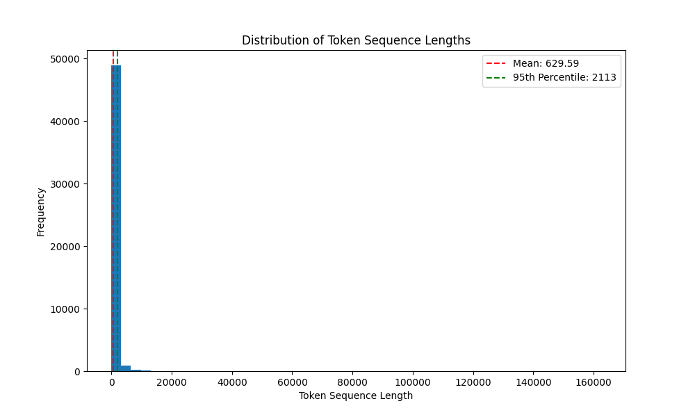

# JSON Chunker for Embedding Preparation

This Python script (`json_chunker.py`) is designed to preprocess and chunk large `.json` documents into manageable, token-sized text blocks optimized for embedding in vector databases. It leverages the `LangChain` library's `RecursiveCharacterTextSplitter` and uses model-specific tokenization via HuggingFace's `transformers`.

---

## 📂 Use Case

The tool is useful in scenarios where structured JSON data—such as technical documents, manuals, reports, or scraped hierarchical content—must be split into semantic chunks before being vectorized and stored in a vector database for Retrieval-Augmented Generation (RAG), search indexing, or machine learning applications.

---

## ⚙️ Features

- 🔍 Token-aware chunking using HuggingFace tokenizers.
- 📁 Recursive handling of nested structures (`sections`, `subsections`, `subsubsections`).
- 🔄 Multithreaded file processing for performance on large corpora.
- 📊 Configurable chunk size and overlap.
- 🧠 Compatible with any transformer tokenizer (e.g., `gpt2`, `bert-base-uncased`, `dunzhang/stella_en_400M_v5`, etc.).
- ✅ Clean and modular design for integration into larger NLP pipelines.

---

## 🧪 Token Distribution Analysis

We chose a maximum chunk size of **2048 tokens** with an overlap of **200 tokens** based on an analysis of the token length distribution across the dataset. This ensures that:

- Most chunks fall below the token limit, reducing truncation.
- Overlaps ensure contextual continuity between adjacent chunks.

📈 **Token Length Distribution:**



> *The majority of text segments are under 2048 tokens, making this chunk size a balanced choice between context richness and embedding efficiency.*

---

## 📦 Requirements

Install the required dependencies via pip:

```bash
pip install transformers langchain tqdm
```

## 🚀 How to Use

### 1. Prepare Your Input

Place your `.json` documents inside an input directory. Make sure each file follows a structure containing:

```json
{
  "content": [
    {
      "subsections": [
        {
          "text_content": "..."
        }
      ]
    }
  ]
}
```

### 2. Run the Script

```bash
python json_chunker.py
```

You can modify key parameters in the script:

* `input_directory`: Path to the folder with input `.json` files.
* `model`: Tokenizer model to use (e.g., `gpt2`, `dunzhang/stella_en_400M_v5`).
* `chunk_size`: Maximum token count per chunk.
* `overlap`: Token overlap between chunks.

### 3. Output

The script saves chunked JSON files inside a `chunked_documents` folder.

---

## 🛠️ Function Breakdown

* `load_json_files`: Loads all JSON files matching a pattern from a directory.
* `process_document`: Recursively traverses the JSON structure and splits all `text_content`.
* `RecursiveCharacterTextSplitter`: Ensures chunks are intelligently split on logical boundaries (paragraphs, sentences, spaces).
* `token_counter`: Uses HuggingFace tokenizer to count tokens per chunk.

---

## 📁 Directory Structure

```
project/
├── json_chunker.py
├── chunked_documents/
│   ├── chunked_0_filename.json
│   └── ...
└── token_length_distribution.png
```

---

## 🧠 Motivation

Proper chunking of text is **critical for downstream NLP tasks** like embedding and retrieval. Overly long chunks may exceed model limits, while too-small chunks may lack semantic richness. This tool strikes the right balance.

---

## 📬 Contact

If you have questions or suggestions, feel free to reach out!

