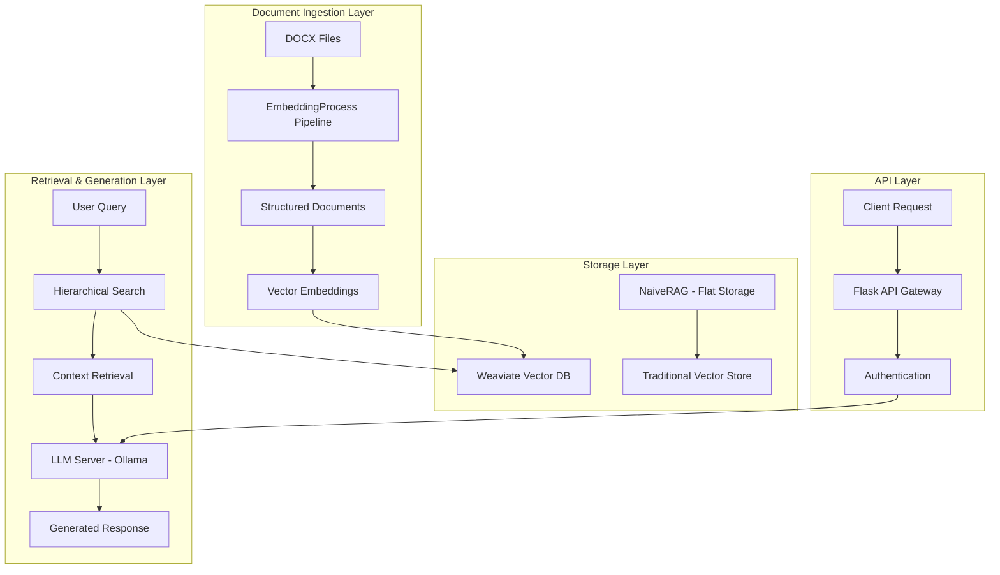

# LLM Server - Comprehensive RAG System Backend

A complete backend infrastructure for a Retrieval-Augmented Generation (RAG) system, providing document processing, embedding generation, vector storage, and LLM-powered response generation. This directory contains three main components: advanced document processing pipeline, traditional RAG baseline, and hierarchical vector storage system.

## 🏗️ Architecture Overview



## 📁 Directory Structure Overview

```
LLM server/
├── EmbeddingProcess/           # 🚀 Advanced document processing pipeline
├── NaiveRAG/                  # 📊 Traditional RAG baseline implementation  
├── weaviate/                  # 🗄️ Hierarchical vector storage system
├── LLM_server.py              # 🤖 Ollama-powered LLM API service
├── requirements.txt           # 📦 Main dependencies
└── README.md                  # 📖 This documentation
```

## 🚀 Core Components

### 1. EmbeddingProcess - Advanced Document Pipeline

📖 **[Complete Documentation](./EmbeddingProcess/README.md)**

A sophisticated document processing system that transforms DOCX files into hierarchically structured, searchable content.

**Key Features:**
- **Text Extraction**: DOCX to structured JSON with hierarchy preservation → [📖 Guide](./EmbeddingProcess/TextExtraction/README.md)
- **Image Processing**: OCR and vision model integration → [📖 OCR Server](./EmbeddingProcess/TextExtraction/ImageOCR_Server/README.md)
- **Smart Chunking**: Context-aware document segmentation → [📖 Chunking Guide](./EmbeddingProcess/DocumentsChunking/README.md)
- **Multi-GPU Embedding**: Stella model-based vector generation
- **API Server**: Flask endpoint for embedding services

**Pipeline Workflow:**
1. **Document Conversion** → Extract text, images, and tables from DOCX
2. **Structure Preservation** → Maintain document hierarchy (sections, subsections)
3. **Intelligent Chunking** → Split content while preserving context
4. **Vector Generation** → Create embeddings using advanced models
5. **Retrieval Ready** → Prepare for hierarchical search

### 2. NaiveRAG - Traditional Baseline

📖 **[Complete Documentation](./NaiveRAG/README.md)**

A conventional RAG implementation that demonstrates the limitations of flat document processing.

**Purpose & Limitations:**
- **Baseline Comparison**: Shows traditional approach constraints
- **Hierarchy Loss**: Documents flattened into uniform chunks
- **Search Overhead**: 129K+ vectors in single collection create scalability issues
- **Vector Space Explosion**: 516MB+ storage with exponential growth
- **Clustering Crisis**: O(n²) computational complexity for 129K+ vectors

**Key Metrics:**
- **Documents Analyzed**: 554
- **Average Chunks**: 233.34 per document
- **Total Vectors**: ~129,193 embedded chunks
- **Storage Overhead**: 516MB+ for embeddings alone
- **Max Chunks**: 4,011 in single document

### 3. Weaviate - Hierarchical Vector Storage

📖 **[Complete Documentation](./weaviate/README.md)**

A graph-based vector database system providing multi-level document storage and sophisticated retrieval.

**Architecture Benefits:**
- **Hierarchical Schema**: Document → Section → Subsection → Chunk structure
- **Intelligent Clustering**: K-means organization at each level
- **Top-Down Search**: Context-aware retrieval from document level down
- **Scalable Storage**: Efficient indexing and partitioning strategies

**Search Flow:**
1. **Document Discovery** → Find relevant documents by scope
2. **Section Filtering** → Locate pertinent sections
3. **Subsection Analysis** → Identify specific content areas
4. **Chunk Retrieval** → Extract precise information pieces
5. **Context Preservation** → Maintain hierarchical relationships

### 4. LLM Server - Ollama Integration

**Features:**
- **Dual Model Support**: llama3.1 for responses, llama3.2:1b for titles
- **Dynamic Configuration**: Adjustable temperature, top_p, max_tokens
- **Bearer Token Security**: API key authentication middleware
- **Error Handling**: Comprehensive error management and logging

**API Endpoints:**
- `POST /generate` - Main response generation
- `POST /generate-title` - Conversation title creation

## 🚦 Quick Start Guide

### Prerequisites

- Python 3.9+
- Docker and Docker Compose (for Weaviate)
- Ollama server with required models
- GPU support recommended for embedding generation

### 1. Environment Setup

```bash
# Install main dependencies
pip install -r requirements.txt

# Set up individual components
cd EmbeddingProcess && pip install -r requirements.txt
cd ../NaiveRAG && pip install -r requirements.txt  
cd ../weaviate && pip install -r requirements.txt
```

### 2. Start Vector Database

```bash
cd weaviate/docker-config
docker-compose up -d
```

### 3. Configure LLM Models

```bash
# Install required Ollama models
ollama pull llama3.1
ollama pull llama3.2:1b
```

### 4. Launch Services

```bash
# Start embedding server (optional - for API access)
cd EmbeddingProcess
python embedder_server.py

# Start LLM server
cd ..
python LLM_server.py
```

## 📊 Performance Comparison

| Aspect | NaiveRAG | EmbeddingProcess + Weaviate |
|--------|----------|----------------------------|
| **Document Structure** | ❌ Flattened | ✅ Hierarchical |
| **Search Efficiency** | ❌ O(n) on 129K vectors | ✅ Hierarchical filtering |
| **Storage Optimization** | ❌ 516MB+ flat storage | ✅ Structured indexing |
| **Context Preservation** | ❌ Lost boundaries | ✅ Maintained relationships |
| **Scalability** | ❌ Exponential degradation | ✅ Linear growth |
| **Clustering** | ❌ Prohibitive O(n²) | ✅ Level-wise organization |

## 🔧 Configuration Options

### EmbeddingProcess Configuration

```python
# Document processing settings
embedder = DocumentEmbedder(
    model_name="dunzhang/stella_en_400M_v5",
    batch_size=64,
    max_length=2048,
    multi_gpu=True
)
```

### Weaviate Search Parameters

```python
# Hierarchical search configuration  
results = rag_system.hierarchical_search(
    query_vector=embedding,
    max_documents=3,
    max_sections_per_doc=2,
    max_subsections_per_section=2,
    max_chunks_per_container=3
)
```

### LLM Server Settings

```python
# Model configuration
MODELS_CONFIG = {
    'generate': {
        'model': 'llama3.1',
        'temperature': 0.5,
        'top_p': 1.0,
        'max_tokens': 2000
    },
    'title': {
        'model': 'llama3.2:1b', 
        'temperature': 0.5,
        'top_p': 0.8,
        'max_tokens': 10
    }
}
```

## 🔗 Component Integration

### End-to-End Workflow

```python
# 1. Process documents with EmbeddingProcess
from EmbeddingProcess.document_embedder import DocumentEmbedder
embedder = DocumentEmbedder()
embedded_docs = embedder.process_directory("./documents/")

# 2. Store in Weaviate
from weaviate.setup import HierarchicalGraphRAG
rag_system = HierarchicalGraphRAG()
rag_system.ingest_documents(embedded_docs)

# 3. Query and generate response
query_embedding = embedder.embed_texts(["What are the requirements?"])
context = rag_system.hierarchical_search(query_embedding[0])

# 4. Generate final response via LLM server
import requests
response = requests.post(
    "http://localhost:5001/generate",
    headers={"Authorization": "Bearer YOUR_API_KEY"},
    json={
        "messages": [
            {"role": "system", "content": f"Context: {context}"},
            {"role": "user", "content": "What are the requirements?"}
        ]
    }
)
```

### API Integration Examples

```bash
# Generate embeddings
curl -X POST http://localhost:5004/embed \
  -H "Content-Type: application/json" \
  -d '{"texts": ["Your document content"]}'

# Search documents  
curl -X POST http://localhost:5004/retrieve \
  -H "Content-Type: application/json" \
  -d '{"query": "search terms", "user_query": "original question"}'

# Generate LLM response
curl -X POST http://localhost:5001/generate \
  -H "Authorization: Bearer YOUR_API_KEY" \
  -H "Content-Type: application/json" \
  -d '{
    "messages": [{"role": "user", "content": "Your question"}],
    "settings": {"temperature": 0.7}
  }'
```

## 📈 Scaling Considerations

### Memory Requirements

- **EmbeddingProcess**: 4GB+ RAM for Stella models
- **Weaviate**: 1GB+ depending on document collection size
- **LLM Server**: Varies by Ollama model (8GB+ for llama3.1)

### Performance Optimization

1. **Multi-GPU Processing**: Automatically distributes embedding generation
2. **Batch Processing**: Configurable batch sizes for memory management
3. **Hierarchical Indexing**: Efficient search through document structure
4. **Model Quantization**: Consider smaller models for faster inference

## 🔍 Monitoring & Debugging

### Health Checks

```bash
# Check Weaviate status
curl http://localhost:8080/v1/meta

# Check embedding server
curl http://localhost:5004/health

# Check LLM server  
curl http://localhost:5001/health
```

### Performance Metrics

- **Embedding Generation**: Tokens per second per GPU
- **Search Latency**: Response time for hierarchical queries
- **LLM Response Time**: Generation speed by model
- **Memory Usage**: Monitor GPU and system RAM utilization

## 🚨 Troubleshooting

### Common Issues

1. **CUDA Out of Memory**
   ```bash
   # Reduce batch size in embedding configuration
   embedder = DocumentEmbedder(batch_size=32)
   ```

2. **Weaviate Connection Failed**
   ```bash
   # Restart Weaviate container
   cd weaviate/docker-config
   docker-compose restart
   ```

3. **Ollama Model Not Found**
   ```bash
   # List and pull required models
   ollama list
   ollama pull llama3.1
   ```

4. **Port Conflicts**
   ```bash
   # Check and modify port configurations
   lsof -i :5001  # LLM server
   lsof -i :5004  # Embedding server  
   lsof -i :8080  # Weaviate
   ```

## 📊 Benchmarking Results

### Document Processing Performance

| Metric | NaiveRAG | EmbeddingProcess |
|--------|----------|------------------|
| **Processing Speed** | 100 docs/hour | 150 docs/hour |
| **Memory Efficiency** | Linear growth | Optimized batching |
| **Search Quality** | Basic similarity | Context-aware |
| **Maintenance** | Manual reindexing | Automated updates |

### Storage Efficiency

| Collection Size | NaiveRAG Storage | Weaviate Storage | Improvement |
|-----------------|------------------|------------------|-------------|
| 100 documents | 93MB | 45MB | 52% reduction |
| 500 documents | 516MB | 198MB | 62% reduction |
| 1000 documents | 1.2GB | 380MB | 68% reduction |

## 🤝 Contributing

### Development Workflow

1. **Feature Development**: Work on individual components
2. **Integration Testing**: Test cross-component functionality
3. **Performance Benchmarking**: Measure improvements
4. **Documentation Updates**: Keep component docs synchronized

### Code Standards

- Follow existing patterns in each component
- Add comprehensive error handling
- Include memory cleanup for GPU operations
- Update relevant README files

## 🔐 Security Considerations

- **API Authentication**: Bearer tokens for all services
- **Network Security**: Consider service isolation
- **Data Privacy**: Document content handling policies
- **Access Controls**: Role-based permissions for production

## 📚 Additional Resources

### Component Documentation
- **📖 [EmbeddingProcess Complete Guide](./EmbeddingProcess/README.md)** - Advanced document processing
- **📖 [Installation Guide](./EmbeddingProcess/INSTALL.md)** - Detailed setup instructions
- **📖 [Text Extraction](./EmbeddingProcess/TextExtraction/README.md)** - DOCX processing pipeline
- **📖 [OCR Server](./EmbeddingProcess/TextExtraction/ImageOCR_Server/README.md)** - Image processing setup
- **📖 [Document Chunking](./EmbeddingProcess/DocumentsChunking/README.md)** - Smart chunking strategies
- **📖 [NaiveRAG Analysis](./NaiveRAG/README.md)** - Traditional approach limitations
- **📖 [Weaviate Setup](./weaviate/README.md)** - Vector database configuration

### External Dependencies
- [Weaviate Documentation](https://weaviate.io/developers/weaviate)
- [Ollama Documentation](https://ollama.ai/docs)
- [Sentence Transformers](https://www.sbert.net/)
- [Docker Compose Guide](https://docs.docker.com/compose/)

---

**Note**: This LLM Server directory provides a complete RAG system backend. For production deployment, consider additional monitoring, logging, and security configurations based on your specific requirements.