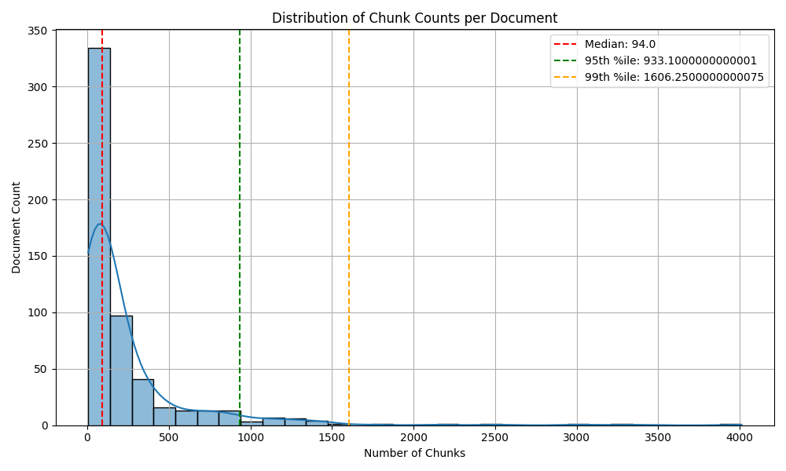
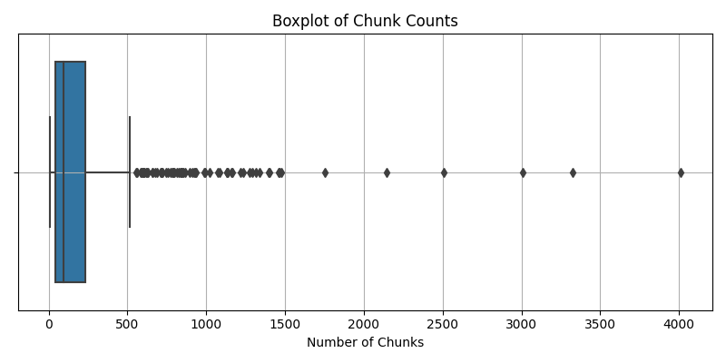

# NaiveRAG: Traditional Document Processing Pipeline

This directory implements the conventional approach to Retrieval-Augmented Generation (RAG) systems, demonstrating the limitations of flat document chunking and embedding. This traditional method processes documents by converting them to uniform chunks, losing hierarchical structure and creating search overhead.

## 🎯 Purpose

The NaiveRAG pipeline serves as a baseline implementation to showcase:
- **Hierarchy Loss**: Documents are flattened into uniform chunks, losing structural information
- **Search Overhead**: Large number of chunks creates computational burden during retrieval
- **Uneven Distribution**: Documents vary dramatically in chunk count, leading to retrieval imbalance

## 📊 Chunk Distribution Analysis

Our analysis of 554 documents reveals significant distribution issues:

```
Documents analyzed: 554
Min chunks: 6
Max chunks: 4,011
Mean: 233.34
Median: 94.0
95th Percentile: 933.10
99th Percentile: 1,606.25
Standard Deviation: 396.34
```

### Key Observations:

- **Extreme Variance**: Chunk counts range from 6 to over 4,000 per document
- **Heavy-Tailed Distribution**: 5% of documents contain 933+ chunks
- **Search Imbalance**: Some documents dominate the search space with excessive chunks
- **Processing Inefficiency**: High standard deviation (396.34) indicates inconsistent processing loads

## 📈 Visual Analysis

### Distribution Histogram


The histogram shows a heavily right-skewed distribution with most documents having fewer than 500 chunks, but a long tail extending to over 4,000 chunks.

### Box Plot Analysis


The box plot reveals numerous outliers, indicating that many documents have chunk counts far exceeding the typical range.

## 🛠️ Pipeline Components

### 1. Document Conversion (`DocxToMarkdown.py`)
```python
# Converts DOCX files to Markdown format
pypandoc.convert_file(docx_path, 'markdown')
```
- **Input**: DOCX files from `DocxDataset/`
- **Output**: Markdown files in `MarkdownFiles/`
- **Purpose**: Standardizes document format for processing

### 2. Document Chunking (`DocumentChunker.py`)
```python
# Creates uniform chunks using RecursiveCharacterTextSplitter
text_splitter = RecursiveCharacterTextSplitter(
    chunk_size=max_chunk_size,
    chunk_overlap=chunk_overlap,
    length_function=token_counter,
    separators=["\n\n", "\n", " ", ""]
)
```
- **Input**: Markdown files
- **Output**: JSON files with chunk arrays in `ChunkedDocuments/`
- **Configuration**:
  - Model: `dunzhang/stella_en_400M_v5`
  - Max chunk size: 1,024 tokens
  - Overlap: 100 tokens
  - Vector Size: 768
- **Limitations**: Ignores document structure and hierarchy

### 3. Document Embedding (`DocumentEmbedder.py`)
```python
# Multi-GPU embedding generation
embeddings = embedder.embed_texts(chunks)
```
- **Input**: Chunked JSON files
- **Output**: Embedded JSON files in `EmbeddedJsons/`
- **Features**:
  - Multi-GPU support for faster processing
  - Batch processing (64 chunks per batch)
  - CLS token embeddings
- **Problem**: Creates massive embedding databases without context preservation

## 🚨 Identified Issues

### 1. **Hierarchy Loss**
- Document structure (headings, sections, subsections) is completely flattened
- Context boundaries are ignored, leading to semantically meaningless chunks
- Cross-reference information is lost

### 2. **Vector Space Explosion**
- Total embedded chunks across all documents: **129,193 vectors** (554 × 233.34 average)
- Vector database collection exceeds **1 million dimensions** when considering embedding dimensionality
- Clustering such massive vector spaces creates exponential computational overhead
- Single flat collection prevents efficient indexing and partitioning strategies

### 3. **Search Overhead**
- Documents with 4,000+ chunks dominate the search space
- Retrieval systems must process thousands of irrelevant chunks
- Query performance degrades with database size: O(n) similarity search across 129K+ vectors
- **Clustering overhead**: K-means or hierarchical clustering on 1M+ dimensional space is computationally prohibitive

### 4. **Storage Inefficiency & Scalability Crisis**
- **Storage explosion**: ~129,193 × 4KB = 516MB+ just for embeddings
- Vector database storage grows linearly with chunk count, not document count
- **Memory bottleneck**: Loading entire vector collection into memory for clustering
- Index maintenance becomes increasingly expensive with collection size

### 5. **Unbalanced Representation**
- Small documents (6 chunks) are under-represented in search results
- Large documents (4,000+ chunks) create noise and redundancy
- Median document (94 chunks) gets lost among outliers

## 📁 Directory Structure

```
NaiveRAG/
├── DocumentChunker.py          # Text chunking implementation
├── DocumentEmbedder.py         # Multi-GPU embedding generation
├── DocxToMarkdown.py          # DOCX to Markdown conversion
├── chunk_count_boxplot.png    # Box plot visualization
├── chunk_count_distribution.png # Distribution histogram
├── requirements.txt           # Python dependencies
└── README.md                  # This documentation
```

## 🔧 Installation & Usage

### Prerequisites
```bash
pip install -r requirements.txt
```

### Required Libraries
- `transformers` - For tokenization and embedding models
- `langchain` - For text splitting utilities
- `torch` - For GPU acceleration
- `pypandoc` - For document conversion
- `tqdm` - For progress tracking

### Running the Pipeline

1. **Convert Documents**:
```bash
python DocxToMarkdown.py
```

2. **Chunk Documents**:
```bash
python DocumentChunker.py
```

3. **Generate Embeddings**:
```bash
python DocumentEmbedder.py
```

## 📊 Performance Metrics

- **Total Vector Count**: ~129,193 embedded chunks (554 documents × 233.34 average chunks)
- **Vector Database Size**: Single collection with 1M+ dimensional space
- **Processing Speed**: ~64 chunks per batch per GPU
- **Memory Usage**: Scales linearly with chunk count (not document count)
- **Storage Overhead**: ~516MB+ for embeddings alone (~4KB per chunk)
- **Search Complexity**: O(n) where n = 129,193+ total chunks
- **Clustering Complexity**: O(n²) to O(n³) for 129K+ vectors - computationally prohibitive
- **Index Maintenance**: Exponential degradation with collection growth

## 🔍 Use Cases

This traditional approach works reasonably well for:
- Small document collections (< 100 documents)
- Uniform document sizes and structures
- Simple question-answering without context requirements
- Proof-of-concept RAG implementations

## ⚠️ Limitations Summary

1. **Vector Space Scalability Crisis**: 129K+ vectors in single collection create 1M+ dimensional clustering problems
2. **Storage Explosion**: 516MB+ for embeddings with exponential growth as document collection expands
3. **Clustering Overhead**: O(n²) computational complexity makes vector space organization prohibitively expensive
4. **Context Loss**: No preservation of document hierarchy or structure
5. **Search Quality Degradation**: Diluted results due to massive chunk volume in single vector space
6. **Resource Inefficiency**: High storage and computational overhead with poor cache locality
7. **Index Fragmentation**: Single flat collection prevents efficient partitioning and distributed indexing
8. **Maintenance Nightmare**: Difficult to update, reindex, or modify 129K+ vector representations

## 🚀 Next Steps

This NaiveRAG implementation serves as a baseline for comparison with more sophisticated approaches that:
- Preserve document hierarchy
- Implement intelligent chunking strategies
- Use multi-level indexing
- Optimize for retrieval quality over quantity

---

*This implementation demonstrates why traditional flat-chunking approaches struggle with real-world document collections and motivates the need for hierarchical, structure-aware RAG systems.*