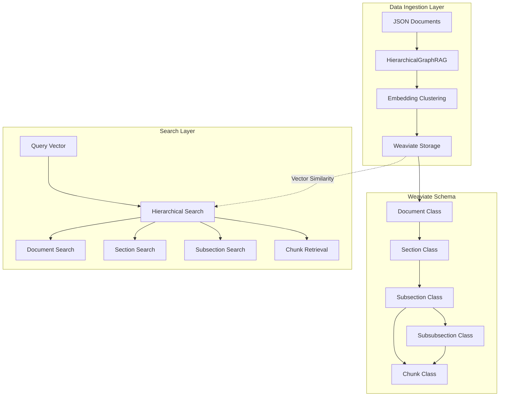

# Weaviate RAG Storage System

A hierarchical graph-based Retrieval-Augmented Generation (RAG) system built on Weaviate vector database. This system provides multi-level document storage and retrieval capabilities with sophisticated embedding-based search across document hierarchies.

## 🏗️ Architecture Overview



## 📁 Directory Structure

```
weaviate/
├── docker-config/
│   └── docker-compose.yml      # Weaviate containerization
├── embedder_downloader.py      # Embedding model utilities
├── requirements.txt            # Python dependencies
├── retrieve.py                # Search interface and CLI
├── setup.py                   # Core RAG system implementation
└── README.md                  # This file
```

## 🚀 Quick Start

### Prerequisites

- Docker and Docker Compose
- Python 3.8+
- Sufficient RAM for embedding models (4GB+ recommended)

### 1. Start Weaviate Instance

```bash
cd docker-config
docker-compose up -d
```

This starts Weaviate on:
- HTTP: `http://localhost:8080`
- gRPC: `localhost:50051`

### 2. Install Dependencies

```bash
pip install -r requirements.txt
```

### 3. Initialize and Ingest Data

```python
from setup import HierarchicalGraphRAG

# Initialize the system
rag_system = HierarchicalGraphRAG(
    weaviate_url="http://localhost:8080",
    num_clusters=10
)

# Create schema
rag_system._create_schema()

# Ingest your JSON documents
rag_system.ingest_documents(your_json_data)
```

### 4. Run Interactive Search

```bash
python retrieve.py --verbose
```

## 🏛️ Data Schema

The system implements a hierarchical document structure in Weaviate:


## 🔍 Hierarchical Search Engine

The search system implements a top-down hierarchical approach:


### Search Flow Details

1. **Document Discovery**: Searches documents by scope using vector similarity
2. **Section Filtering**: Finds relevant sections within discovered documents
3. **Subsection Analysis**: Identifies pertinent subsections using embeddings
4. **Dual Chunk Retrieval**:
   - Direct chunks from subsections
   - Chunks from subsubsections within subsections
5. **Result Compilation**: Maintains hierarchical context throughout

## ⚙️ Configuration Options

### HierarchicalGraphRAG Parameters

```python
rag_system = HierarchicalGraphRAG(
    weaviate_url="http://localhost:8080",  # Weaviate instance URL
    num_clusters=10                        # K-means clustering parameter
)
```

### Search Parameters

```python
results = rag_system.hierarchical_search(
    query_vector=embedding,
    max_documents=3,                       # Max documents to retrieve
    max_sections_per_doc=2,               # Max sections per document
    max_subsections_per_section=2,        # Max subsections per section
    max_subsubsections_per_subsection=2,  # Max subsubsections per subsection
    max_chunks_per_container=3            # Max chunks per container
)
```

## 🖥️ Command Line Interface

The `retrieve.py` script provides an interactive search interface:

```bash
# Basic usage
python retrieve.py

# With custom parameters
python retrieve.py \
    --weaviate-url http://localhost:8080 \
    --model dunzhang/stella_en_400M_v5 \
    --max-docs 5 \
    --max-sections 3 \
    --max-subsections 3 \
    --max-chunks 5 \
    --verbose

# Save results to file
python retrieve.py --output search_results.json
```

### CLI Options

| Option | Default | Description |
|--------|---------|-------------|
| `--weaviate-url` | `http://localhost:8080` | Weaviate instance URL |
| `--model` | `dunzhang/stella_en_400M_v5` | Sentence transformer model |
| `--fallback-model` | `all-MiniLM-L6-v2` | Fallback embedding model |
| `--max-docs` | 3 | Maximum documents to retrieve |
| `--max-sections` | 2 | Maximum sections per document |
| `--max-subsections` | 2 | Maximum subsections per section |
| `--max-subsubsections` | 2 | Maximum subsubsections per subsection |
| `--max-chunks` | 3 | Maximum chunks per container |
| `--verbose` | False | Enable detailed output |
| `--output` | `results.json` | Output file for results |

## 🔧 Advanced Features

### Clustering Integration

The system uses K-means clustering to organize embeddings at each hierarchical level:

```python
def _cluster_embeddings(self, embeddings: List[List[float]]) -> List[int]:
    # Handles edge cases: empty lists, single vectors, duplicate vectors
    # Uses sklearn KMeans with intelligent cluster count adjustment
    # Falls back to simple assignment if clustering fails
```

### Embedding Model Support

- **Primary**: Stella models (requires xformers)
- **Fallback**: all-MiniLM-L6-v2
- **Extensible**: Any sentence-transformers compatible model

### Error Handling

- Automatic fallback for failed model loading
- Graceful degradation for clustering failures
- Comprehensive error reporting with stack traces

## 📊 Performance Considerations

### Memory Usage

- **Stella Models**: ~2GB RAM
- **Weaviate**: 1GB+ depending on data size
- **Clustering**: Scales with document count

### Optimization Tips

1. **Batch Processing**: Process documents in batches for large datasets
2. **Cluster Tuning**: Adjust `num_clusters` based on data diversity
3. **Model Selection**: Use lighter models for faster inference
4. **Index Optimization**: Configure Weaviate HNSW parameters

## 🐳 Docker Configuration

The included `docker-compose.yml` provides:

```yaml
version: '3.4'
services:
  weaviate:
    image: cr.weaviate.io/semitechnologies/weaviate:1.30.2
    ports:
      - "8080:8080"
      - "50051:50051"
    environment:
      AUTHENTICATION_ANONYMOUS_ACCESS_ENABLED: 'true'
      PERSISTENCE_DATA_PATH: '/var/lib/weaviate'
      DEFAULT_VECTORIZER_MODULE: 'none'
    volumes:
      - weaviate_data:/var/lib/weaviate
    restart: on-failure:0
```

## 🔬 Example Usage

### Basic Search Example

```python
from sentence_transformers import SentenceTransformer
from setup import HierarchicalGraphRAG

# Initialize components
model = SentenceTransformer("dunzhang/stella_en_400M_v5")
rag_system = HierarchicalGraphRAG("http://localhost:8080")

# Generate query embedding
query = "What are the main security requirements?"
query_embedding = model.encode([query], prompt_name="s2p_query")[0].tolist()

# Perform hierarchical search
results = rag_system.hierarchical_search(
    query_vector=query_embedding,
    max_documents=3,
    max_sections_per_doc=2,
    max_subsections_per_section=2,
    max_chunks_per_container=3
)

# Access results
print(f"Found {len(results['documents'])} documents")
print(f"Found {len(results['sections'])} sections")
print(f"Found {len(results['chunks'])} chunks")
```

### Result Structure

```python
{
    "documents": [
        {
            "document_name": "Security Guidelines",
            "scope_title": "Security Framework",
            "scope_description": "Comprehensive security framework..."
        }
    ],
    "sections": [
        {
            "title": "Authentication Requirements",
            "description": "User authentication protocols...",
            "parent_document": "Security Guidelines"
        }
    ],
    "subsections": [...],
    "subsubsections": [...],
    "chunks": [
        {
            "content": "Multi-factor authentication is required...",
            "parent_document": "Security Guidelines",
            "parent_section": "Authentication Requirements",
            "parent_subsection": "MFA Implementation"
        }
    ]
}
```

## 🚨 Troubleshooting

### Common Issues

1. **Weaviate Connection Failed**
   ```bash
   # Check if Weaviate is running
   docker-compose ps
   curl http://localhost:8080/v1/meta
   ```

2. **Model Loading Errors**
   ```bash
   # Install xformers for Stella models
   pip install xformers
   ```

3. **Memory Issues**
   ```bash
   # Monitor system resources
   docker stats
   # Reduce model size or batch size
   ```

4. **Schema Conflicts**
   ```python
   # Clear existing schema
   rag_system.client.schema.delete_all()
   rag_system._create_schema()
   ```

## 📝 Dependencies

Key Python packages:

- `weaviate-client`: Vector database client
- `sentence-transformers`: Embedding generation
- `scikit-learn`: Clustering algorithms
- `numpy`: Numerical operations
- `tqdm`: Progress tracking

## 🤝 Contributing

1. Fork the repository
2. Create a feature branch
3. Add comprehensive tests
4. Update documentation
5. Submit a pull request

## 📄 License

This project is licensed under the MIT License - see the LICENSE file for details.

## 🆘 Support

For issues and questions:

1. Check the troubleshooting section
2. Review Weaviate documentation
3. Open an issue with detailed error logs
4. Include system specifications and data characteristics

---

**Note**: This system is designed for research and development. For production use, consider additional security, monitoring, and scaling configurations.